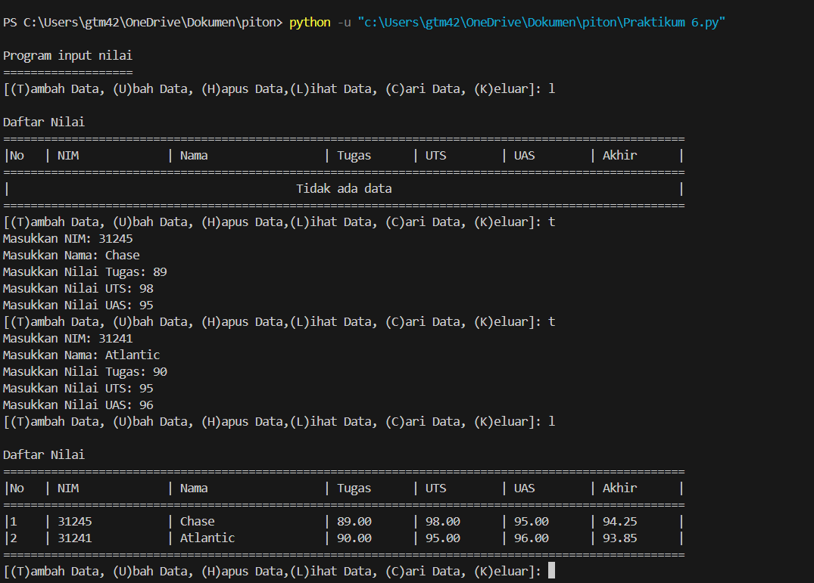

# Program Menampilkan Daftar Nilai Mahasiswa
Program ini merupakan program sederhana yang di buat menggunakan tipe data Python Dictionary,  adalah tipe data yang memungkinkan penyimpanan informasi
dalam satu variabel dengan format key:value bersifat mutable, artinya kita dapat menambah, mengubah, atau menghapus pasangan kunci-nilai setelah dictionary dibuat
# Deskripsi Program
Program ini dibuat menggunakan bahasa python Dictionary dengan fitur:
* *Menambahkan data mahasiswa baru:* Pengguna dapat memasukkan NIM, Nama, Nilai tugas, UTS, dan UAS. Program akan menghitung nilai akhir secara otomatis berdasarkan bobot yang telah ditentukan.
* *Melihat daftar nilai:* Program akan menampilkan semua data mahasiswa yang sudah tersimpan dalam format tabel yang mudah dibaca.
* *Mengubah data mahasiswa:* Pengguna dapat mengubah data mahasiswa yang sudah ada berdasarkan NIM.
* *Menghapus data mahasiswa:* Pengguna dapat menghapus data mahasiswa yang sudah tidak diperlukan.
* *Mencari data mahasiswa:* Pengguna dapat mencari data mahasiswa berdasarkan NIM.
## Flowchart Programan

# Kode Program
```python
print('\nProgram input nilai')
print('=' * 19)


# menghitung nilai akhir mahasiswa
def hitung_nilai_akhir(tugas, uts, uas):
    return (tugas * 0.3) + (uts * 0.35) + (uas * 0.35)

# menambah data mahasiswa
def tambah_data(data):
    nim = input('Masukkan NIM: ')
    nama = input("Masukkan Nama: ")
    tugas = float(input("Masukkan Nilai Tugas: "))
    uts = float(input("Masukkan Nilai UTS: "))
    uas = float(input("Masukkan Nilai UAS: "))
    nilai_akhir = hitung_nilai_akhir(tugas, uts, uas)
    data[nim] = {'Nama': nama, 'Tugas': tugas, 'UTS': uts, 'UAS': uas, 'Akhir': nilai_akhir}

# mengubah data mahasiswa
def ubah_data(data):
    nim = input("Masukkan NIM mahasiswa yang ingin diubah: ")
    if nim in data:
        nama = input("Masukkan Nama baru: ")
        tugas = float(input("Masukkan Nilai Tugas baru: "))
        uts = float(input("Masukkan Nilai UTS baru: "))
        uas = float(input("Masukkan Nilai UAS baru: "))
        nilai_akhir = hitung_nilai_akhir(tugas, uts, uas)
        data[nim] = {'Nama': nama, 'Tugas': tugas, 'UTS': uts, 'UAS': uas, 'Akhir': nilai_akhir}
    else:
        print("Data tidak ditemukan!")

# menghapus data mahasiswa
def hapus_data(data):
    nim = input("Masukkan NIM mahasiswa yang ingin dihapus: ")
    if nim in data:
        del data[nim]
        print("Data berhasil dihapus!")
    else:
        print("Data tidak ditemukan!")

# menampilkan data mahasiswa
def tampilkan_data(data):
    if data:
        print("\nDaftar Nilai")
        print("=" * 100)
        print(f"|{'No':<4} | {'NIM':<15} | {'Nama':<20} | {'Tugas':<10} | {'UTS':<10} | {'UAS':<10} | {'Akhir':<10} |") 
        print("=" * 100)
        for i, (nim, nilai) in enumerate(data.items(), start=1):
            print(f"|{i:<4} | {nim:<15} | {nilai['Nama']:<20} | {nilai['Tugas']:<10.2f} | {nilai['UTS']:<10.2f} | {nilai['UAS']:<10.2f} | {nilai['Akhir']:<10.2f} |")
        print("=" * 100)
    else:
        print("\nDaftar Nilai")
        print("=" * 100)
        print(f"|{'No':<4} | {'NIM':<15} | {'Nama':<20} | {'Tugas':<10} | {'UTS':<10} | {'UAS':<10} | {'Akhir':<10} |") 
        print("=" * 100)
        print(f"|{'Tidak ada data'.center(98)}|")
        print("=" * 100)

# mencari data mahasiswa berdasarkan NIM
def cari_data(data):
    nim = input("Masukkan NIM mahasiswa yang ingin dicari: ")
    if nim in data:
        print("\nData ditemukan:")
        print("=" * 50)
        print(f"NIM     : {nim}")
        print(f"Nama    : {data[nim]['Nama']}")
        print(f"Tugas   : {data[nim]['Tugas']:.2f}")
        print(f"UTS     : {data[nim]['UTS']:.2f}")
        print(f"UAS     : {data[nim]['UAS']:.2f}")
        print(f"Nilai Akhir: {data[nim]['Akhir']:.2f}")
        print("=" * 50)
    else:
        print("Data tidak ditemukan!")

# Fungsi utama
def main():
    data_mahasiswa = {}
    while True:
        pilihan = input("[(T)ambah Data, (U)bah Data, (H)apus Data,(L)ihat Data, (C)ari Data, (K)eluar]: " )
        if pilihan == 't':
            tambah_data(data_mahasiswa)
        elif pilihan == 'u':
            ubah_data(data_mahasiswa)
        elif pilihan == 'h':
            hapus_data(data_mahasiswa)
        elif pilihan == 'l':
            tampilkan_data(data_mahasiswa)
        elif pilihan == 'c':
            cari_data(data_mahasiswa)
        elif pilihan == 'k':
            break
        else:
            print("Pilihan tidak valid. Silakan coba lagi.")

if __name__ == "__main__":
    main()

```
# Output Program



# Cara Kerja Program
Program sederhana ini menggunakan tipe data dictionary dalam Python untuk menyimpan data mahasiswa. Setiap kunci dalam dictionary adalah NIM mahasiswa, dan nilainya adalah dictionary lain yang berisi informasi lengkap tentang mahasiswa tersebut (nama, nilai tugas, UTS, UAS, dan nilai akhir).
1. Menu Utama akan ditampilkan setiap kali program dijalankan.
2. Pengguna dapat memilih salah satu opsi menu:
    - Tambah Data Fungsi ini menambahkan data mahasiswa baru ke dalam dictionary.
    - Ubah Data Fungsi ini mengubah data mahasiswa yang sudah ada.
    - Hapus Data Fungsi ini menghapus data mahasiswa.
    - Tampilkan Data Fungsi ini menampilkan semua data mahasiswa yang tersimpan dalam format tabel.
    - Cari Data Fungsi ini mencari data mahasiswa berdasarkan NIM.
    - Keluar
   Program akan menjalankan fungsi yang sesuai dengan pilihan pengguna.

   Setelah selesai, program akan kembali ke Menu Utama.
   Jika pengguna memilih Keluar, program akan berhenti berjalan.